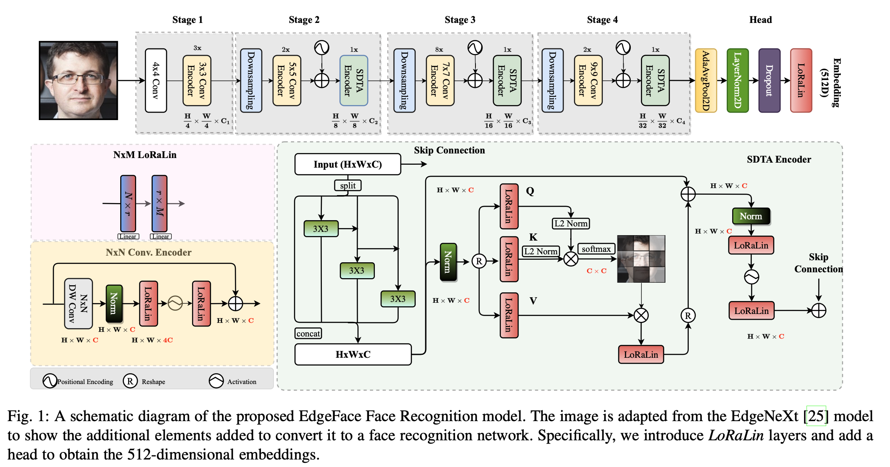

# EdgeFace: Efficient Face Recognition Model for Edge Devices

[](https://paperswithcode.com/sota/lightweight-face-recognition-on-lfw?p=edgeface-efficient-face-recognition-model-for)
[](https://paperswithcode.com/sota/lightweight-face-recognition-on-calfw?p=edgeface-efficient-face-recognition-model-for)
[](https://paperswithcode.com/sota/lightweight-face-recognition-on-cplfw?p=edgeface-efficient-face-recognition-model-for)
[](https://paperswithcode.com/sota/lightweight-face-recognition-on-cfp-fp?p=edgeface-efficient-face-recognition-model-for)
[](https://paperswithcode.com/sota/lightweight-face-recognition-on-agedb-30?p=edgeface-efficient-face-recognition-model-for)	
[](https://paperswithcode.com/sota/lightweight-face-recognition-on-ijb-b?p=edgeface-efficient-face-recognition-model-for)	
[](https://paperswithcode.com/sota/lightweight-face-recognition-on-ijb-c?p=edgeface-efficient-face-recognition-model-for)	

[](https://arxiv.org/abs/2307.01838v2)


This repository contain inference code and pretrained models to use [**EdgeFace: Efficient Face Recognition Model for Edge Devices**](https://ieeexplore.ieee.org/abstract/document/10388036/), 
which is the **winning entry** in *the compact track of ["EFaR 2023: Efficient Face Recognition Competition"](https://arxiv.org/abs/2308.04168v2) organised for the IEEE/IAPR International Journal of Central Banking (IJCB) 2023*. For the complete source code of training and evaluation, please check the [official repository](https://gitlab.idiap.ch/bob/bob.paper.tbiom2023_edgeface).





## Installation
```sh
$ pip install -r requirements.txt
```

## Inference
The following code shows how to use the model for inference:
```python
import torch
from torchvision import transforms
from face_alignment import align
from backbones import get_model

# load model
model_name="edgeface_s_gamma_05" # or edgeface_xs_gamma_06
model=get_model(model_name)
checkpoint_path=f'checkpoints/{arch}.pt'
model.load_state_dict(torch.load(checkpoint_path, map_location='cpu')).eval()

transform = transforms.Compose([
            transforms.ToTensor(),
            transforms.Normalize(mean=[0.5, 0.5, 0.5], std=[0.5, 0.5, 0.5]),
            ])

path = 'path_to_face_image'
aligned = align.get_aligned_face(path) # align face
transformed_input = transform(aligned) # preprocessing

# extract embedding
embedding = model(transformed_input)
```


## Pre-trained models
- EdgeFace-s (gamma=0.5): available in [`checkpoints/edgeface_s_gamma_05.pt`](checkpoints/edgeface_s_gamma_05.pt)
- EdgeFace-xs (gamma=0.6): available in [`checkpoints/edgeface_xs_gamma_06.pt`](checkpoints/edgeface_xs_gamma_06.pt)


## Performance
The performance of each model is reported in Table 2 of the [paper](https://arxiv.org/pdf/2307.01838v2.pdf):


## Reference
If you use this repository, please cite the following paper, which is [published](https://ieeexplore.ieee.org/abstract/document/10388036/) in the IEEE Transactions on Biometrics, Behavior, and Identity Science (IEEE T-BIOM). The PDF version of the paper is available as [pre-print on arxiv](https://arxiv.org/pdf/2307.01838v2.pdf). The complete source code for reproducing all experiments in the paper (including training and evaluation) is also publicly available in the [official repository](https://gitlab.idiap.ch/bob/bob.paper.tbiom2023_edgeface).


```bibtex
@article{edgeface,
  title={Edgeface: Efficient face recognition model for edge devices},
  author={George, Anjith and Ecabert, Christophe and Shahreza, Hatef Otroshi and Kotwal, Ketan and Marcel, Sebastien},
  journal={IEEE Transactions on Biometrics, Behavior, and Identity Science},
  year={2024}
}
```